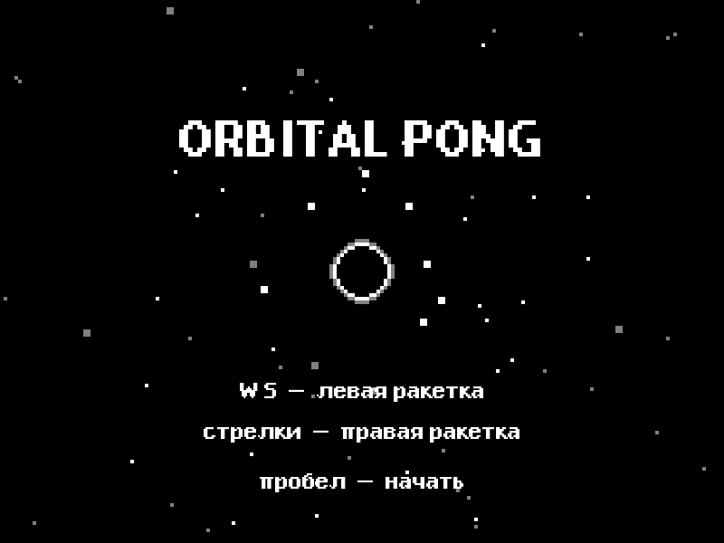
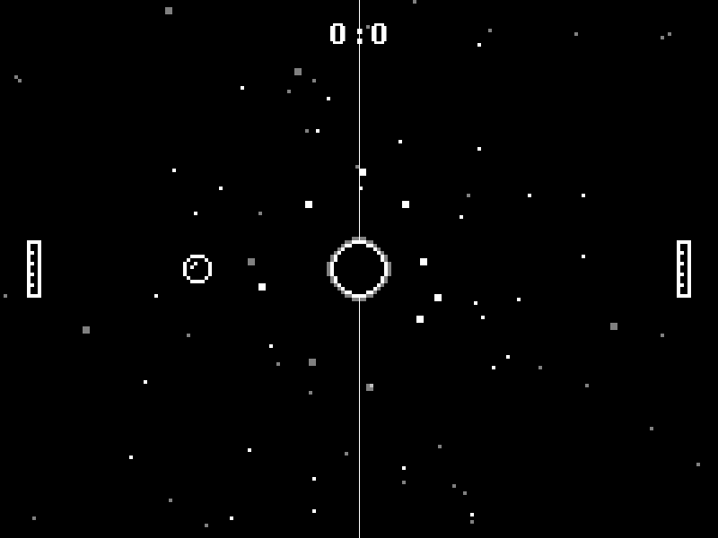
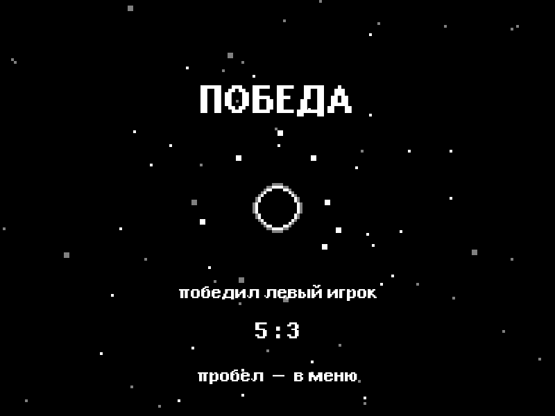

# Orbital Pong
## «Орбитальный Понг»

Orbital Pong — это пинг-понг на двоих. По центру поля стоит чёрная дыра. Она притягивает мяч, поэтому он летит не по прямой, а по дуге.

Партия идёт до 5 очков. Очко получает тот игрок, мимо ракетки которого мяч не пролетел.

---

## Стек технологий

- **Python 3.14**
- **Pygame-ce 2.5.8** — окно, отрисовка, клавиатура и звук

---

## Структура проекта

```
polarity run/
├── python_game/
│   ├── main.py          # запуск игры
│   ├── game.py          # цикл, управление, счёт, экраны
│   ├── settings.py      # размеры окна, гравитация, скорость
│   ├── ball.py          # мяч и притяжение к центру
│   ├── paddle.py        # ракетка
│   ├── black_hole.py    # анимация чёрной дыры
│   └── effects.py       # след мяча и частицы
├── font/
│   └── EpilepsySansBold.ttf
├── sounds/
│   ├── space_song.ogg   # музыка
│   ├── bounce.ogg       # удар
│   └── score.ogg        # гол
├── ball.png
├── paddle.png
├── black_hole.aseprite
└── screenshots/
```

### Назначение модулей

| Модуль | Назначение |
|--------|------------|
| `main.py` | Создаёт игру и запускает её |
| `game.py` | Меню, матч, победа, клавиши, звук |
| `settings.py` | Ширина, высота, FPS, сила гравитации |
| `ball.py` | Координаты мяча и формула притяжения |
| `paddle.py` | Движение ракетки и столкновение |
| `black_hole.py` | Кадры чёрной дыры из файла Aseprite |
| `effects.py` | След мяча, пыль и частицы у дыры |

---

## Запуск игры

Запуск из папки `python_game`:

```bash
cd python_game
python main.py
```

---

## Управление

| Клавиша | Действие |
|---------|----------|
| `W` `S` | Левая ракетка |
| `↑` `↓` | Правая ракетка |
| `Пробел` | Начать партию или вернуться в меню |
| Закрыть окно | Выход |

---

## Механики игры

### Гравитация

В центре поля, в точке (400, 300), стоит чёрная дыра. Каждый кадр считается расстояние `d` от мяча до центра.

Если `d` больше 10, сила считается так:

```python
F = G / (d * d)
vx += F * (center_x - x) / d
vy += F * (center_y - y) / d
```

`G` лежит в `settings.py` и называется `GRAVITY`.

Мяч отскакивает от верхней и нижней границ окна.

### Ракетки и счёт

- Левая ракетка отбивает мяч вправо.
- Правая ракетка отбивает мяч влево.
- Если мяч ушёл за левый край, очко получает правый игрок.
- Если мяч ушёл за правый край, очко получает левый игрок.
- Игра заканчивается, когда у кого-то 5 очков.

---

## Интерфейс

### Стартовый экран

Название игры и подсказка по клавишам. Партия начинается по пробелу.

### Игровой экран

Две ракетки, мяч, чёрная дыра и счёт сверху.

### Экран победы

Надпись «ПОБЕДА», имя победителя и итоговый счёт. Пробел возвращает в меню.

---

## Настройки

Числа игры лежат в `python_game/settings.py`:

```python
WIDTH = 800
HEIGHT = 600
FPS = 60
GRAVITY = 500
PADDLE_SPEED = 6
WIN_SCORE = 5
```

---

## Скриншоты

### Стартовый экран



### Игровой процесс



### Экран победы



---

## Зависимости

Нужен Python 3.12 или новее и Pygame:

```bash
pip install pygame-ce
```

Проверка:

```bash
python -c "import pygame; print(pygame.ver)"
```
